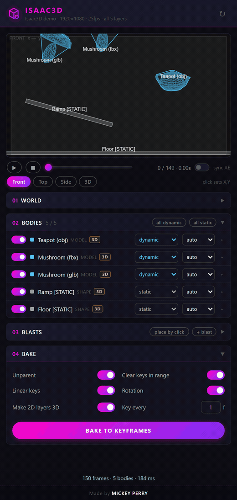
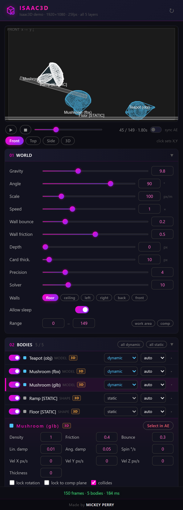

# Isaac3D — 3D physics for After Effects

Rigid-body physics in a dockable After Effects panel, in **real 3D**. Pick layers, set body types, tune gravity and
bounce while a live preview plays, then **Bake** writes honest Position X/Y/Z + Rotation X/Y/Z keyframes onto your
layers. Newton does flat. Isaac does depth.

Built on [cannon-es](https://github.com/pmndrs/cannon-es) — a JavaScript 3D rigid-body engine — so cubes topple,
spheres roll off ramps, and things fall *past* each other in Z the way they should.

**3D model layers are first-class citizens.** Drop a `.glb`, `.gltf`, `.obj` or `.fbx` into your comp (AE 2025+)
and Isaac3D reads the actual mesh: real 3D bounds, a convex hull for collisions, and a wireframe of the model tumbling
in the preview.

Full panel

Free & open source · Windows · After Effects 2020+ (model layers: AE 2025+) · [Project page](https://mickeyperry.github.io/AESCRIPTS/Isaac3D/)

## Install

1. [Download the ZIP](https://github.com/mickeyperry/isaac3d/archive/refs/heads/main.zip) and extract it anywhere.
2. Double-click **`install.bat`**. It enables unsigned CEP panels for your user and copies the panel into
   `%APPDATA%\Adobe\CEP\extensions\com.mickyp.isaac3d`.
3. Restart After Effects and open **Window > Extensions > Isaac3D**.

`uninstall.bat` removes it again. Developers: `deploy.ps1` mirrors the working copy into the extensions folder.

## Using it

1. Open a comp. Select the layers you want simulated (nothing selected = all layers) and hit **Refresh**.
2. **Bodies** — per layer:
   - **type** — `dynamic` falls and collides · `static` is immovable (floors, ramps, walls) · `kinematic` follows its
     own AE keyframes and shoves things around · `dormant` sleeps until something hits it.
   - **shape** — `auto` picks from the layer's geometry · `box` · `cube` (a block as deep as its smaller side — square
     cards become crates) · `sphere` · `hull` (convex hull).
   - Click a row for density, friction, bounce, damping, spin, initial velocity, thickness, lock rotation,
     **lock to comp plane** (2D behaviour for flat layers) and collides. Double-click a row to select the layer in AE.
3. **World** — gravity and its angle, px per meter, substeps, time scale, bounce and friction of the bounds, which comp
   edges act as walls (floor / ceiling / left / right / **back / front** with a depth), card thickness for flat layers,
   solver iterations, sleep, and the frame range.
4. **Blasts** — radial impulses at a frame and a 3D point: strength, lift, spin, radius, falloff. Place them by clicking
   in the preview.
5. **Views** — Front, Top, Side (orthographic) and an orbitable 3D perspective. Scrub or play; **sync AE** moves the
   AE playhead with you.
6. **Bake to keyframes**. Options: unparent, clear existing keys in range, linear keys, rotation, make 2D layers 3D,
   key every N frames. One undo step.

Settings are remembered per composition.

### 3D model layers

| Format | Notes |
|---|---|
| `.glb` / `.gltf` | Preferred. External `.bin` buffers are fine; textures are never loaded. Draco / meshopt compression is not supported — re-export without it. |
| `.obj` | Plain geometry, `.mtl` ignored. |
| `.fbx` | Binary and ASCII. Blender exports in cm; AE handles the conversion and so does Isaac3D. |

How it works: After Effects only exposes a model's X/Y extent, not its depth. Isaac3D parses the file itself,
calibrates its pixels-per-unit against AE's own bounds (1 model unit = 512 px), and builds the body from the real
mesh. Dense meshes are vertex-clustered to ~1500 triangles for the preview; the collision hull is capped at 64
vertices so four or five models still simulate in well under a second. `auto` = hull, `box`/`cube` = the real 3D
bounding box, `sphere` = bounding sphere.

A body row shows an orange **!** when a file could not be parsed; the layer then falls back to a block sized from its
AE bounds.

### Tips

- Refresh reads **selected layers only** when anything is selected. Empty list? Deselect all in the timeline first.
- Set the range before baking. Baking is one ExtendScript call per keyframe: 6 layers x 1000 frames is a minute
  of frozen AE. The **every N f** option thins it out.
- Static floors and ramps are just shape layers set to `static`. The comp floor is a wall by default, so you don't
  need one for a simple drop.

## Layout

- `host/isaac3d.jsx` — ExtendScript: reads layers (world basis, shape primitives, masks, model source file), samples
  kinematic layers, bakes keyframes. 3D values are read through slider expressions on a temporary null (AE 26
  throws on direct 3-component reads).
- `client/sim3d.js` — scene -> cannon-es world -> per-frame transforms. AE's `Rx*Ry*Rz` rotation order, no sign flips.
- `client/models.js` — glb/gltf/obj/fbx parsing, bounds, convex hull, vertex-clustering decimation.
- `client/geometry.js` — 2D affine transforms, bezier sampling, convex hull, rounded rects, polystars.
- `client/main.js`, `index.html`, `style.css` — the panel. `client/vendor/` — three.js r147 + loaders (UMD).
- `test/run_node_test.js` — headless smoke test: `node test/run_node_test.js [model files...]`.
- `test/render_panel.js` — renders the panel in headless Chromium with a mocked AE host (the demo GIF comes from here).

## Roadmap

Kinematic-to-dynamic hand-off at a frame (animate by hand, let physics take over), joints (pin / hinge / spring /
rope), wind and attractor fields, per-body gravity scale (balloons), impact markers for sound design, text
per-character bodies, Voronoi shatter of shape layers, collision groups, Mac installer.

## License

MIT — see [LICENSE](LICENSE). Bundles cannon-es (MIT) and three.js r147 (MIT).
